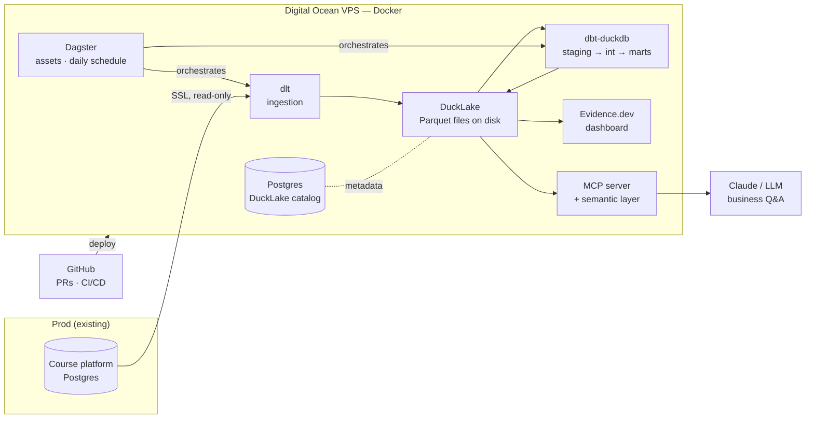

# DBuilders Pipeline

> A complete analytics platform for a real business — my own course platform — built and run by **one person** on a **€12/month server**. AI as coworker (built with Claude Code), AI as consumer (metrics served to LLMs over MCP). No SaaS warehouse bill.

**Status:** 🚧 Phase 0 — repo & practices. This README is written ahead of the code, on purpose (README-driven development).

<!-- badges: CI · deploy · license — added in Phase 5 -->

## What this is

The reference implementation of a modern Analytics Engineering + AI project, used as the demo for my AE mentoring. Every choice is documented, every change ships through a pull request, and the whole thing runs self-hosted.

Real source data: my course platform (students, courses, enrollments, payments, lesson events) in a production Postgres.

## Architecture



## Stack

| Layer | Tool | Why (short version — see docs/decisions/ for the long one) |
|---|---|---|
| Storage | DuckDB + DuckLake (Postgres catalog) | Lakehouse on a VPS: columnar engine, Parquet + snapshots, concurrent readers/writers, ~€0 |
| Ingestion | dlt | Code-first EL an AE can own solo; incremental, schema-evolving |
| Transform | dbt (dbt-duckdb) | Tested, documented, version-controlled models — the core AE craft |
| Orchestration | Dagster | Software-defined assets; dlt + dbt DAG imported natively |
| BI | Evidence.dev | BI-as-code; the dashboard lives in this repo |
| AI access | Semantic layer + MCP server | Governed metrics for LLMs — right answers, not raw-schema guessing |
| Infra | Digital Ocean + Docker | Everything reproducible from `infra/` |

## Repo layout

```
ingestion/      dlt pipelines (prod Postgres → DuckLake raw)
transform/      dbt project (staging → intermediate → marts)
orchestration/  Dagster assets, schedules, alerting
dashboard/      Evidence.dev project
mcp/            semantic layer + MCP server
infra/          Docker compose, server setup — infra as code
docs/           decisions (ADRs), contracts, AI log, style guide
```

## Roadmap

| Phase | Ships | Status |
|---|---|---|
| 0 · Repo & practices | this skeleton, CI stub | 🚧 |
| 1 · Infra (DO) | compose up: catalog PG; SSL to prod | ⬜ |
| 2 · Ingestion (dlt) | raw layer landing nightly, PII-safe | ⬜ |
| 3 · Modeling (dbt) | dimensional model + tests + docs site | ⬜ |
| 4 · Orchestration (Dagster) | nightly unattended runs, alerts | ⬜ |
| 5 · CI/CD | green-PR-only path to prod | ⬜ |
| 6 · Dashboard (Evidence) | live business dashboard | ⬜ |
| 7 · Semantic + MCP | Claude answering business questions | ⬜ |
| 8 · Trust & polish | data health page, seed dataset, the demo | ⬜ |

## Principles

1. **Every change through a PR** — even solo. The git history is part of the product.
2. **AI does syntax, humans own semantics** — AI-assisted throughout, verified against real data. Log in [docs/ai-log.md](docs/ai-log.md).
3. **PII stops at the door** — pseudonymized at ingestion. It's students' data.
4. **Decisions are documented** — [docs/decisions/](docs/decisions/).
5. **A stranger can run it** — synthetic seed dataset ships in Phase 8.

## Cost

Tracked honestly, updated per phase. Target: a single small VPS. <!-- €X/month once Phase 1 lands -->

## Run it yourself

Coming in Phase 8 (seed dataset + one-command local run). Until then, watch the phases land as PRs.
