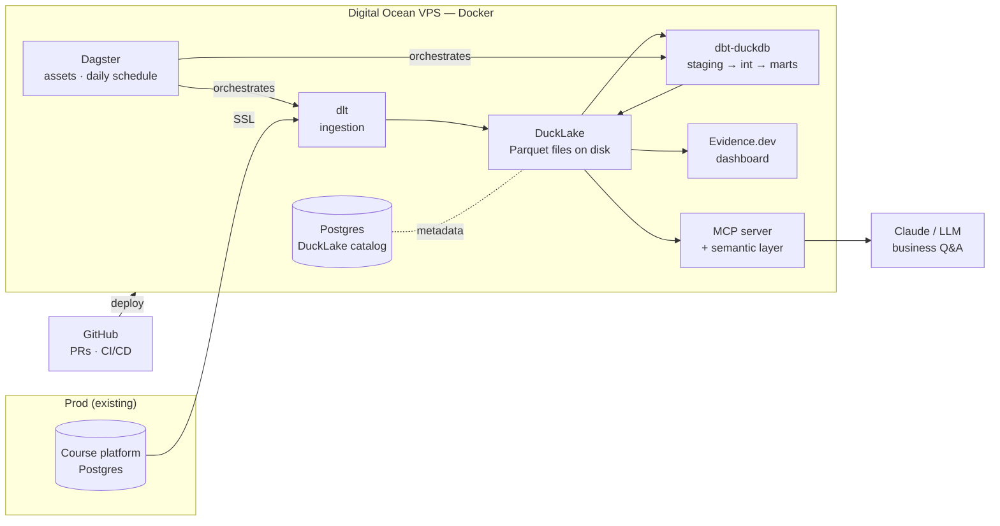

# Course Platform Lakehouse — Build Plan

> The DEMO project: a public GitHub repo showing future students what a great AE+AI data project looks like.
> Own data (course platform, prod Postgres) → self-hosted lakehouse on Digital Ocean → dashboard + AI access.
> Every phase applies Core & Differentiator items from the AE skills reference (Obsidian vault).

**Decisions locked:** DuckDB + DuckLake (Postgres catalog) · Dagster from day one · daily batch · Evidence.dev + semantic layer/MCP on top.

## ⭐ Phases v2 (revised 17/07 — supersedes the numbering below)

| # | Phase | Content | Status |
|---|---|---|---|
| 0 | Repo & practices | skeleton, conventions, git by owner, organic-growth rule | ✅ done |
| 1 | **Dependencies & technology validation** | uv env; deps added one by one *when needed*; Fusion binary pinned; sandbox tests proving each techno before adoption | 🚧 in progress — Fusion+DuckLake proven (ADR 0002), uv setup next |
| 2 | Ingestion | dlt: prod Postgres (read-only, SSL) → DuckLake raw, incremental, PII-safe | ⬜ blocked on: how is prod PG hosted? |
| 3 | Modeling | dbt Fusion: staging → marts, dimensional model, tests, docs | ⬜ |
| 4 | Orchestration | Dagster local: assets, manual runs then schedule | ⬜ |
| 5 | CI/CD | GitHub Actions: lint + dbt build on PR | ⬜ |
| 6 | Dashboard | Evidence.dev on the marts | ⬜ |
| 7 | Semantic + MCP | governed metrics, MCP server, LLM Q&A demo | ⬜ |
| 8 | Droplet (the finale) | DO VPS, Docker packaging of everything, catalog → Postgres, deploy-on-merge, trust & polish | ⬜ |

> 📚 Practices & reference repos: see [best-practices.md](best-practices.md) — the waiting room for everything adopted from elsewhere (datalab repo: env_var() profiles, justfile, …).

## 📍 Next step (updated each session)

**2026-07-22 (soir) → Phase 2 OPEN: first real table (`students`) extracted from Neon.** 🎉

1. Verify in the lake: `just tables` — confirm `students` + `_dlt_*` landed in the raw schema.
2. Decide the full table list from Neon (`\dt`) — per table: incremental cursor? PII columns?
   (PII pseudonymization at ingestion — it's students' data.)
3. Set a stable `dataset_name` (e.g. `raw`) in the pipeline — no dev_mode, ever.
4. Then Phase 3 opens: `transform/` dbt project — env_var() attach, scratch db ≠ alias,
   generate_schema_name override, first staging model on `students`.
5. Housekeeping: rotate the analytics_ro password (it transited chat/shell history) ·
   trim ingestion/.gitignore to the dlt-specific head · commit the day's harvest.

## Architecture

**The two-sentence pitch (for the README):** a complete analytics platform for a real business, built and run by one person on a €12/month server — with AI as coworker (built with Claude Code) and AI as consumer (metrics exposed via MCP). No SaaS warehouse bill.

---

## Phase 0 — Repo & working practices *(the invisible 50% of a great project)*

Elements to put in place:

1. Public GitHub repo, `main` protected, feature-branch → PR workflow **even solo** — every PR is future teaching material.
2. Project skeleton: `ingestion/` · `transform/` (dbt) · `orchestration/` (Dagster) · `dashboard/` (Evidence) · `mcp/` · `infra/` (Docker, compose) · `docs/`.
3. Python tooling: `uv` for env & deps (upgrade from venv — it's on your radar list), `ruff` + `sqlfmt`/`sqlfluff` for lint.
4. `CLAUDE.md` at repo root: project conventions, naming, style guide, warehouse context — the AI's operating manual. Install **dbt agent skills** in Claude Code.
5. Secrets discipline: `.env` + `.env.example`, nothing sensitive in git, DO secrets on server only.
6. README skeleton written **first**: the promise of the project, architecture diagram, "why these choices" section left open.

Practices & activities:

- **README-driven development**: write what you're about to build before building it. Each phase ends by updating the README.
- **Conventional commits** + meaningful PR descriptions — students will read the git history as a narrative.
- **AI pairing loop from day one**: prompt Claude Code with scoped tasks → review the diff → validate against real data → commit. Document one good and one bad AI interaction per phase in `docs/ai-log.md`; this becomes the "how to work with AI" material.

Definition of done: empty pipeline runs end-to-end as a walking skeleton? No — done when repo, tooling, CI stub and README exist and a first PR has been merged.

Skills applied: Git/GitHub flow · Python tooling · prompt & context craft · documentation.

## Phase 1 — Infrastructure (Digital Ocean)

Elements to put in place:

1. DO droplet (2–4 GB RAM is enough to start), SSH hardening, firewall (ufw), non-root user.
2. Docker + docker compose as the single way anything runs on the server.
3. **Catalog Postgres**: small Postgres container (or DO managed PG if you want zero ops) — dedicated to the DuckLake catalog. Keep it separate from prod.
4. SSL connection from VPS → prod course-platform Postgres, read-only replication user with minimal grants (`SELECT` on needed tables only).
5. Storage layout on disk: `/data/lake/` for Parquet files, `/data/backups/`. Simple nightly backup script (tar + DO Spaces or rsync) — a lakehouse you can back up with `cp` is a teaching point.

Practices & activities:

- Everything in `infra/` as code: compose file, setup scripts, documented in `docs/infra.md`.
- Create the read-only user with an explicit grants script committed to the repo (secrets excluded) — **least privilege as a visible practice**.
- Activity: measure and record the monthly cost. "€X/month total" is a headline number for the demo.

Definition of done: `docker compose up` on the VPS brings up catalog PG; VPS can query prod PG over SSL with the read-only user.

Skills applied: Docker & infra · VM setup/optimization · DB SSL · security basics.

## Phase 2 — Ingestion (dlt → DuckLake)

Elements to put in place:

1. dlt pipeline `ingestion/course_platform/`: sources = the prod tables that matter (users, courses, enrollments, payments, lesson/progress events...).
2. Destination: DuckLake (dlt → DuckDB attached to the DuckLake catalog; land as `raw` schema, Parquet on `/data/lake/`).
3. **Incremental loading** where a cursor exists (`updated_at` / event timestamps), full refresh for small dims. Document the choice per table.
4. Schema-drift stance: dlt's schema evolution on, but alert on new/changed columns (this feeds the governance story).
5. PII decision at the door: hash/pseudonymize emails & names **at ingestion** — GDPR by design, and a great teaching moment (student data!).

Practices & activities:

- Write an **ingestion contract** doc per source table: owner, cursor, PII columns, expected volume, freshness expectation.
- Activity: run the first full load, record row counts and duration; compare a full refresh vs incremental run — numbers for the video/README.
- Test restore: delete local lake, re-run, verify idempotency.

Definition of done: daily-runnable ingestion lands all source tables in `raw`, incrementally, PII-safe, re-runnable from zero.

Skills applied: dlt · Python for AE · incremental patterns · PII/GDPR handling · data contracts.

## Phase 3 — Transformation & modeling (dbt-duckdb)

Elements to put in place:

1. dbt project on the dbt-duckdb adapter, attached to DuckLake; `profiles` with `dev` and `prod` targets (dev = local laptop against a copy or dev schema — show the environments practice).
2. Layered structure: `staging` (1:1 sources, renamed/typed/PII-safe) → `intermediate` → `marts`.
3. **The dimensional model of a course business** (the heart — spend real design time here):
   - `dim_student` (SCD2 on plan/status changes — a real SCD example)
   - `dim_course`, `dim_lesson`
   - `fct_enrollments` (grain: one row per student × course)
   - `fct_payments` (grain: one row per transaction)
   - `fct_lesson_events` / `fct_progress` (grain: one row per student × lesson event)
   - Marts on top: revenue (MRR-ish, refunds), engagement (completion rates, active students), funnel (visit → signup → purchase → completion).
4. Testing pyramid: generic tests (unique/not-null/relationships) on every key · `accepted_values` from **real data, verified** · unit tests on the tricky logic (revenue recognition, completion %) · source freshness tests.
5. Docs: every model and column described; `dbt docs` published (static hosting on the VPS behind the same domain).
6. Style guide in repo (`docs/sql-style.md`) — enforced by sqlfluff in CI and referenced by `CLAUDE.md`.

Practices & activities:

- **Design before code**: draw the ERD (grain decisions written down) and PR it as a doc before writing model 1. This PR is the flagship teaching artifact.
- AI practice: have Claude Code draft staging models from the source schemas, then *you* review grain and business logic — the "AI does syntax, human owns semantics" division, documented.
- Activity: one deliberate refactor PR (e.g. splitting a god-model) to demonstrate code review on SQL.

Definition of done: `dbt build` green with tests; marts answer the 10 business questions you'll put on the dashboard; docs site live.

Skills applied: advanced SQL · Kimball modeling · dbt core craft · testing discipline · environments · docs-as-product.

## Phase 4 — Orchestration (Dagster)

Elements to put in place:

1. Dagster project in `orchestration/`: dlt sources and dbt models as **software-defined assets** (use the official dagster-dlt and dagster-dbt integrations — the dbt DAG imports automatically).
2. Daily schedule (nightly, Europe/Paris), with asset-level dependencies: ingestion assets → dbt assets → downstream refresh.
3. Retries + failure alerting (email or Telegram/Slack webhook — cheap and visible).
4. Dagster in Docker on the VPS, web UI behind auth on your domain.

Practices & activities:

- Keep `cron`-style thinking visible: document *why* asset orchestration beats a crontab for this DAG (the pedagogical contrast — you know both).
- Activity: kill a run mid-flight and show recovery; simulate a source failure and show the alert + partial materialization. Record both — failure handling is premium content.

Definition of done: full pipeline runs nightly unattended; a failure produces an alert you actually receive; the asset graph screenshot is in the README.

Skills applied: Dagster/orchestration · alerting & observability · Docker deployment.

## Phase 5 — CI/CD (GitHub Actions)

Elements to put in place:

1. PR pipeline: lint (ruff + sqlfluff) → `dbt build` against an **ephemeral DuckDB/DuckLake test target** with a data subset — full test suite on every PR.
2. Deploy pipeline on merge to `main`: build/pull images, `docker compose up -d` on the VPS via SSH action.
3. Status badges in README (build, deploy).

Practices & activities:

- Demonstrate a failing PR: push a change that breaks a test, show CI blocking the merge, fix it — the whole loop as a short recorded sequence.
- Slim-CI idea (only build modified models + downstream) as a documented optimization step.

Definition of done: no path to prod except a green PR merged to main; deploy is one merge away, hands-off.

Skills applied: CI/CD for data · quality gates · deployment automation.

## Phase 6 — Delivery I: the Evidence dashboard

Elements to put in place:

1. Evidence project in `dashboard/`, reading DuckLake marts directly.
2. Pages: **Business overview** (revenue, MRR-ish, refunds) · **Students & engagement** (actives, completion, cohort retention) · **Funnel** (signup → purchase → completion) · **About this platform** (meta page: architecture, cost, freshness — the demo selling itself).
3. Built & deployed as static site on the VPS (rebuilt by Dagster after nightly run, or by CI on merge).

Practices & activities:

- Apply dashboard craft: every page answers a named business question; annotate definitions (link each metric to its semantic-layer definition).
- Activity: a "metrics review" pass — check dashboard numbers against 3 hand-written SQL spot checks; document.

Definition of done: public (or auth-protected) dashboard URL with real daily-fresh numbers you'd show a stranger.

Skills applied: BI-as-code · metric communication · stakeholder-facing delivery.

## Phase 7 — Delivery II: semantic layer + MCP (the "for AI" proof)

Elements to put in place:

1. Semantic definitions for the ~10 core metrics (revenue, active students, completion rate, ...): dimensions, grains, time aggregations. Options: dbt MetricFlow definitions, or a lean YAML metrics spec of your own if MetricFlow × duckdb friction is too high — evaluate and **document the decision** either way.
2. **MCP server** in `mcp/`: tools like `list_metrics`, `get_metric(metric, dims, period)`, `run_checked_query` — querying DuckLake read-only, returning definitions alongside numbers.
3. Wire into Claude (desktop / Claude Code): demo natural-language questions — "How was revenue last month vs previous?" — answered from *governed* metrics, not raw SQL guessing.
4. Guardrails: read-only DB user for the MCP server, row limits, no PII exposure — AI governance made concrete.

Practices & activities:

- The before/after demo: ask the LLM a business question with raw-schema access vs with the semantic MCP — show the wrong-vs-right answers. This is the single most persuasive artifact of the whole project.
- Activity: write `docs/ai-context.md` — what context the AI gets, why, and what it's denied.

Definition of done: a recorded session of Claude answering 5 business questions correctly through the MCP server, definitions cited.

Skills applied: semantic layer · MCP · AI context provision · AI governance · LLM app basics.

## Phase 8 — Trust layer & polish *(what makes it "top level")*

Elements to put in place:

1. Freshness & volume monitoring surfaced somewhere visible (Dagster checks + a small "data health" page in Evidence).
2. Ownership & lineage: dbt docs lineage graph linked in README; explicit `meta: owner` on every mart.
3. `SECURITY.md`-style data note: what PII exists, how it's protected, retention.
4. README final form: pitch → architecture diagram → live links (dashboard, docs, asset graph) → cost breakdown → "why these choices" → "build it yourself" pointers.
5. Short demo GIF/video at the top of the README.

Practices & activities:

- **The student test**: give the repo to one outsider (or a future mentee) — can they explain the project and run `docker compose up` locally with the seed dataset? Fix what confuses them.
- Provide a **synthetic seed dataset** so anyone can run the whole stack without your prod data — this is what turns *your* pipeline into *their* template.

Definition of done: a stranger stars the repo because the README alone convinced them; a mentee can run it locally in under 30 minutes.

Skills applied: observability · governance · documentation & communication · portfolio craft.

---

## Suggested build order & effort

| # | Phase | Effort (focused sessions) | Ships publicly |
|---|---|---|---|
| 0 | Repo & practices | 1 | repo + README skeleton |
| 1 | Infra DO | 1–2 | infra-as-code, cost number |
| 2 | Ingestion dlt | 2 | raw layer landing nightly |
| 3 | dbt modeling | 3–4 | the model + docs site |
| 4 | Dagster | 2 | asset graph, nightly runs |
| 5 | CI/CD | 1–2 | badges, blocked-PR demo |
| 6 | Evidence | 2 | live dashboard |
| 7 | Semantic + MCP | 2–3 | the AI demo |
| 8 | Trust & polish | 1–2 | the README that sells |

~15–19 sessions total. Phases 0–5 are strictly sequential; 6 and 7 can swap; 8 runs partly throughout (README updated every phase).

## Skills coverage check (vs the reference)

- Covered Core: advanced SQL · Kimball modeling · warehouse fundamentals (via DuckLake) · dbt · Jinja · git/PR/code review · CI/CD · environments · testing · Python · managed-EL concepts (documented contrast) · orchestration · BI · quality/observability · docs/lineage · PII/GDPR · AI coding agents · AI-ready data.
- Covered Differentiator: DuckDB+DuckLake · dbt project architecture · Docker/VPS end-to-end · dlt · BI-as-code · contracts & ownership · dbt agent skills · AI validation discipline · prompt/context craft · semantic layer · MCP · AI context provision.
- Deliberately out of v1: Snowflake/BigQuery hands-on (concept-mapping doc instead) · streaming/Kafka · RAG & vector DB (natural v2: RAG over course *content*) · reverse ETL · dbt Fusion (watch: adapter support) · Diogenes upgrade (v2 candidate).
- Not coverable by a solo demo: stakeholder translation & data-literacy coaching — that's what the mentoring itself demonstrates.

## Open questions (park, don't block)

- MetricFlow on duckdb vs lean own spec — decide in Phase 7 with a 1-hour spike.
- Domain & auth strategy for the public-facing pieces (dashboard public? behind basic auth?).
- Whether each phase becomes one video (likely) — if yes, film terminal sessions from Phase 0.
